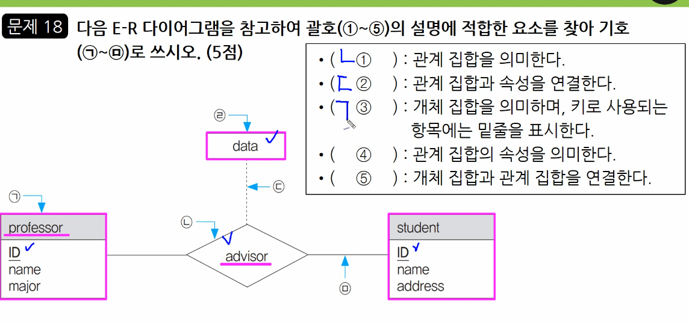

1. C언어 4중 for 문 쓰레기 문제(해설만 3시간 13분50초 패스)

2. 관계 대수
    - 관계대수는 관계형 데이터베이스에서 원하는 정보와 그 정보를 검색하기 위해서 
      어떻게 유도하는가를 기술하는 절차적인 언어이다. 관계대수에 사용되는 연산은 다음과 같다.
      - 합집합(UNION) 은 두 릴레이션에 존재하는 튜플의 합집합을 구하되, 결과로 생성된 릴레이션에서 중복되는 튜플은 제거되는 연산으로, 사용하는 기호는 ( U ) 이다.
      - 차집합(DIFFERENCE) 은 두 릴레이션에 존재하는 튜플의 합집합을 구하되, 결과로 생성된 릴레이션에서 중복되는 튜플은 제거 되는 연산으로, 사용하는 기호는 ( - )이다.
      - 교차곱 (CARTESIAL PRODUCT) 은 두 릴레이션에 있는 튜플들의 순서쌍을 구하는 연산으로, 사용하는 기호는 ( X )이다.
      - 프로젝트(PROJECT) 는 주어진 릴레이션에서 속성 리스트(Attribute List)에 제시된 속성 값만을 추출하여 새로운 릴레이션을 만드는 연산으로, 사용하는 기호는 ( 파이 ) 이다.
      - 조인(JOIN) 은 공통 속성을 중심으로 두 개의 릴레이션을 하나로 합쳐서 새로운 릴레이션을 만드는 연산으로, 사용하는 기호는 ( 보타이 ) 이다.

3. 디자인 패턴
    - (  **Bridge** ) 은 구현부에서 추상층을 분리하여 각자 독립적으로 변형이 가능하고 확장이 가능하도록 합니다. 즉 기능과 구현에 대해서 두 개를 별도의 클래스로 구현을 합니다.
    - ( **observer )** 한 객체의 상태가 바뀌면 그 객체에 의존하는 다른 객체들한테 연락이 가고, 자동으로 내용이 갱신되는 방식의 패턴이다. 
    - **디자인 패턴** 은 모듈 간의 관계 및 인터페이스를 설계 할 때 참조할 수 있는  
      전형적인 해결 방식 또는 예제를 의미함.  
      **GOF의 디자인패턴**은 생성 패턴, 구조 패턴, 행위 패턴 로 구분 됨
        ---
 * 생성 패턴 : 클래스나 객체의 생성과 참조 과정을 정의하는 패턴
    - **추상팩토리(Abstract Factory)** : 구체적인 클래스에 의존하지 않고, 인터페이스를 통해 서로 연관 의존하는 객체들의 그룹으로 생성하여 추상적으로 표현함.
    - **빌더(Builder)**: 작게 분리된 인스턴스를 건축 하듯이 조합하여 객체를 생성함.
        객체의 생성 과정과 표현 방법을 분리하고 잇어, 동일한 객체 생성에서도 서로 다른 결과를 만들어 낼 수 있음
    - **팩토리 메소드(Factory Method)** : 가상 생성자(Virtual Constructor) 패턴
        객체 생성을 서브 클래스에서 처리하도록 분리하여 캡슐화 한 패턴으로 상위 클래스에서 인터페이스만 정의하고 실제 생성은 서브 클래스가 담당함
    - **프로토타입(Prototype)** : 원본 객체를 복제하는 방법으로 객체를 생성하는 
        패턴으로 일반적인 방법으로 객체를 생성하며, 비용이 큰 경우 주로 이용함
    - **싱글톤(Singleton)** : 하나의 객체를 생성하면 생성된 객체를 어디서든 참조할
        수 있지만, 여러 프로세스가 동시에 참조할 수는 없고, 클래스 내에서 인스턴스가 하나뿐임을 보장하며, 불필요한 메모리 낭비를 최소화 할 수 있음
 * **구조 패턴** : 구조가 복잡한 시스템을 개발하기 쉽도록 클래스나 객체들을 조합하여 
    더 큰 구조로 만드는 패턴
    - **어댑터(Adapter)** : 호환성이 없는 클래스들의 인터페이스를 다른 클래스가 이용할 수 있도록 변환해주는 패턴으로, 기존의 클래스를 이용하고 싶지만 인터페이스가 일치하지 않을 때 이용함
    - **브리지(Bridge)** : 구현부에서 추상층을 분리하여, 서로가 독립적으로 확장할 수 있도록 구성 한 패턴으로 , 기능과 구현을 두 개의 별도 클래스로 구현함
    - **컴포지트(Composite)** : 여러 객체를 가진 복합 객체와 단일 객체를 구분 없이 다루고자 할 때 사용하는 패턴으로, 객체들을 트리 구조로 구성하여 디렉터리 안에 디렉터리가 있듯이 복합 객체 안에 복합 객체가 포함되는 구조를 구현 할 수 있음
    - **데코레이터(Decorator)** : 객체간의 결합을 통해 능동적으로 기능들을 확장할 수 있는 패턴으로, 임의의 객체에 부가적인 기능을 추가하기 위해 다른 객체들을 덧붙이는 방식으로 구현함
    - **퍼싸드(Facade)** : 복잡한 서브 클래스들을 피해 더 상위에 인터페이스를 구성함으로써 서브 클래스들의 기능을 간편하게 사용할 수 있도록 하는 패턴으로, 서브 클래스들 사이의 통합 인터페이스를 제공하는 Wrapper 객체가 필요함
    - **플라이웨이트(Flyweight)** : 인스턴스가 필요할 때마다 매번 생성하는 것이 아니고 가능한 한 공유해서 사용함으로써 메모리를 절약하는 패턴으로, 다수의 유사 객체를 생성하거나 조작할 때 유용하게 사용할 수 있음
    - **프록시(Proxy)** : 접근이 어려운 객체와 여기에 연결하려는 객체 사이에서  
      인터페이스 역할을 수행하는 패턴으로, 네트워크 연결, 메모리의 대용량 객체로의 접근 등에 주로 이용함.
 * 행위 패턴 : 클래스나 객체들이 서로 상호작용하는 방법이나 책임 분배 방법을 정의하는 패턴
    - **책임연쇄(Chain of Responsibility)** : 요청을 처리할 수 있는 객체가 둘 이상  
      존재하여 한 객체가 처리하지 못하면 다음 객체로 넘어가는 형태의 패턴으로, 요청을 처리할 수 있는 각 객체들이 고리로 묶여 있어 요청이 해결될 때까지 고리를 따라 책임이 넘어감
    - **커맨드(Command)** : 요청을 객체의 형태로 캡슐화하여 재이용하거나 취소 할 수 
      있도록 요청에 필요한 정보를 저장하거나 로그에 남기는 패턴으로 , 요청에 사용되는 각종 명령어들을 추상 클래스와 구체 클래스로 분리하여 단순화 함
    - **인터프리터(Interpreter)** : 언어에 문법 표현을 정의하는 패턴으로, SQL이나 
      통신 프로토콜과 같은 것을 개발할 때 사용함
    - **반복자(Iterator)** : 자료 구조와 같이 잦은 객체에 대해 동일한 인터페이스를 
      사용하도록 하는 패턴으로, 내부 표현 방법의 노출 없이 순차적인 접근이
    - **중재자(Mediator)** : 수많은 객체들 간의 복잡한 상호작용(Interface)을 
      캡슐화하여 객체로 정의하는 패턴으로, 객체 사이의 의존성을 줄여 결합도를 감소시킬 수 있음
    - **메멘토(Memento)** : 특정 시점에서의 객체 내부 상태를 객체화함으로써 이후 
      요청에 따라 객체를 해당 시점의 상태로 돌릴 수 있는 기능을 제공하는 패턴으로, ctrl+z와 같은 되돌리기 기능을 개발할 때 주로 이용함
    - **옵서버(Observer)** : 한 객체의 상태가 변화하면 객체에 상속되어 있는 다른 
      객체들에게 변화 된 상태를 전달하는 패턴으로, 일대다의 의존성을 정의함, 주로 분산된 시스템 간에 이벤트를 생성 발행 하고 , 수신 해야 할 때 이용함
    - **상태(State)** : 객체의 상태에 따라 동일한 동작으르 다르게 처리해야 할 때 
      사용하는 패턴으로, 객체 상태를 캡슐화하고 이를 참조하는 방식으로 처리함
    - **전략(Strategy)** : 동일한 계열의 알고리즘들을 개별적으로 캡슐화하여 상호 
      교환할 수 있게 정의하는 패턴으로, 클라이언트는 독립적으로 원하는 알고리즘을 선택하여 사용할 수 있으며, 클라이언트에 영향 없이 알고리즘의 변경이 가능함
    - **템플릿 메소드(Template Method)** : 상위 클래스에서 골격을 정의하고, 하위  
      클래스 에서 세부 처리를 구체화하는 구조의 패턴으로, 유사한 서브 클래스를 묶어 공통된 내용을 상위 클래스에서 정의함으로써 코드의 양을 줄이고 유지보수를 용이하게 해줌
    - **방문자(Visitor)** : 각 클래스들의 데이터 구조에서 처리 기능을 분리하여 별도의 
      클래스로 구성하는 패턴으로, 분리된 처리 기능은 각 클래스를 방문(visit)하여 수행

4. java 실행 결과
    ```java
    public class exam_22_3_4 {
        public static void main(String[] args) {
            int result[] = new int[5];
            int arr[] = {77, 32, 10, 99, 50};
            for(int i=0;i<5; i++){
                result[i] = 1;
                for(int j=0 ; j<5 ; j++){
                    if(arr[i] < arr[j])
                        result[i]++;
                }
            }
                for(int k=0 ; k<5; k++)
                    System.out.print(result[k]);
            
        }
    }   
    ==> 24513
    ```

5. 서브넷 마스크  192.168.1.0 / 24 네트워크를 FLSM 방식을 이용하여 3개의 Subnet으로 
   나누었을 때, 두 번째 네트워크의 브로드캐스트 IP주소를 10진수 방식으로 쓰시오.
      네트워크 주소    브로드캐스트 주소
    - 192.168.1.0    ~ 192.168.1.63
    - 192.168.1.64   ~ 192.168.1.127
    - 192.168.1.128  ~ 192.168.1.191
    - 192.168.1.192  ~ 192.168.1.255

6. 경계값 분석 (Boundary Value Analysis) : 테스트 기법 중 각 영역의 경계에 해당하는
   입력값을 넣고, 예상되는 출력값이 나오는지 실제 값과 비교하는 명세 기반 테스트 기법
 * 블랙박스 테스트(Black Box Test) - 각 기능이 완전히 작동되는 것을 입증하는 테스트
    - 동치 분할 검사(Equivalence Partitioning Testing, 동치 클래스 분해)
    - 경계값 분석(Boundary Value Analysis)
    - 원인-효과 그래프 검사(Cause-Effect Graphing Teshting)
    - 오류예측 검사(Error Guessing)
    - 비교 검사(Comparison Testing)
 * 화이트박스 테스트(White Box Test) - 원시 코드의 논리적인 모든 경로를 테스트하여 
  테스트 케이스를 설계하는 방법

7. 쿼리 결과

    ```SQL
    CREATE TABLE 부서(
        부서코드 INT PRIMARY KEY,
        부서명 VARCHAR(20)
    );

    CREATE TABLE 직원(
        직원코드 INT PRIMARY KEY,
        부서코드 INT,
        직원명 VARCHAR(20),
        FOREIGN KEY(부서코드) REFERENCES 부서(부서코드)
            ON DELETE CASCADE
    );

    INSERT INTO 부서 VALUES(10, '영업부');
    INSERT INTO 부서 VALUES(20, '기획부');
    INSERT INTO 부서 VALUES(30, '개발부');

    INSERT INTO 직원 VALUES(1001, 10, '이진수');
    INSERT INTO 직원 VALUES(1002, 10, '곽연경');
    INSERT INTO 직원 VALUES(1003, 20, '김선길');
    INSERT INTO 직원 VALUES(1004, 20, '최민수');
    INSERT INTO 직원 VALUES(1005, 20, '이용갑');
    INSERT INTO 직원 VALUES(1006, 30, '박종일');
    INSERT INTO 직원 VALUES(1007, 30, '박미경');

    1. SELECT DISTINCT COUNT(부서코드) FROM 직원 WHERE 부서코드 = 20;
    ==> 3
    DELETE FROM 부서 WHERE 부서코드 = 20;
    SELECT DISTINCT COUNT(부서코드) FROM 직원;
    ==> 4

8. 용어
    - ( 사회공학 )은 컴퓨터 보안에 있어서, 인간 상호 작용의 깊은 신회를 바탕으로 사람들을 속여 정상 보안 절차를 깨트리기 위한 비기술적 시스템 침입 수단을 의미한다.
    - ( 다크데이터 ) 는 특정 목적을 가지고 데이터를 수집하였으나, 이후 활용되지 않고 저장만 되어있는 대량의 데이터를 의미한다. 미래에 사용될 가능성을 고려하여 저장 공간에서 삭제되지 않고 보관 되어 있으나, 이는 저장 공간의 낭비뿐만 아니라 보안 위험을 초래 할 수도 있다.
*
    - 세션 하이재킹 
        - 상호 인증 과정을 거친 후 접속해 있는 서버와 서로 접속되어 클라이언트 사이의 세션 정보를 가로채는 공격 기법으로, 접속을 위한 인증 정보 없이도 가로챈 세션을 이용해 공격자가 원래의 클라이언트인 것처럼 위장하여 서버의 자원이나 데이터를 무단으로 사용함.
        - TCP 3-Way-Handshake 과정에 끼어듦으로써 클라이언트와 서버 간의 동기화 된 시퀀스 번호를 가로채 서버에 무단으로 접근하는 TCP 세션 하이재킹이 대표적임
    - ARP Spoofing
        - ARP의 취약점을 이용한 공격 기법으로, 자신의 물리적 주소(MAC)를 공격대상의 것으로 변조하여 공격 대상에게 도달해야 하는 데이터 패킷을 가로채거나 방해함
    - 스미싱(Smishing)
        - 문자메시지를 이용해 사용자의 개인 신용 정보를 빼내는 수법
    - 타이포스쿼팅(Typosquatting)
        - 네트즌들이 사이트에 접속할 때 주소를 잘못 입력하거나 철자를 빠뜨리는 실수를 이용하기 위해 이와 유사한 유명 동메인을 미리 등록하는 일로, URL 하이재킹(Hijacking) 이라고도 함
    - APT(Advanced Persistent Threats, 지능형 지속 위협)
        - 다향한 IT 기술과 방식들을 이용해 조직적으로 특정 기업이나 조직 네트워크에 침투해 활동 거점을 마련한 뒤 때를 기다리면서 보안을 무력화시키고 정보를 수집한 다음 외부로 빼돌리는 형태의 공격 
    - 무작위 대입 공격 (Grute Force Attack)
        - 암호화된 문서의 암호키를 찾아내기 위해 적용 가능한 모든 값을 대입하여 공격하는 방식
    - 큐싱(Qshing)
        - QR코드를 통해 악성 앱의 다운로드를 유도하거나 악성 프로그램을 설치하도록 하는 금융사기 기법
    - SQL 삽입(Injection) 공격
        - 전문 스캐너 프로그램 혹은 봇넷 등을 이용해 웹사이트를 무차별벅으로 공격하는 과정에서 취약한 사이트가 발견되면 데이터베이스 등의 데이터를 조작하는 일련의 공격 방식
    - 크로스 사이트 스크립팅(XSS ; Cross Site Scripting)
        - 네트워크를 통한 컴퓨터 보안 공격의 하나로 , 췝 페이지의 내용을 사용자 브라우저에 표현하기 위해 사용되는 스크립트의 취약점을 악용한 해킹 기법
    - 스티핑(Sniffing)
        - 네트워크의 중간에서 남의 패킷 정보를 도청하는 해킹 유형의 하나로 수동적 공격에 해당함
    - 사회공학
    - 스피어 피싱
    - 다크 데이터
    
9. Python
    ```Python
    a = [1, 2, 3, 4, 5]
    a = list(map(lambda num : num + 100, a))
    print(a)

    ==> [101, 102, 103, 104, 105]

10. 다양한 장비에서 발생하는 로그 및 이벤트를 통합하여 관리하는 보안 솔루션으로
    , 방화벽, IDS, IPS, 웹 방화벽, VPN 등에서 발생한 로그 및 이벤트를 통합하여 관리함으로써 비용 및 자원을 절약할 수 있는 특징이 있다. 또한 보안 솔루션 간의 상호 연동을 통해 종합적인 보안 관리 체계를 수립할 수 있다.
    ==> SIEM , Security Information & Event Management

11. 형상 관리 도구 => CVS, Git SVN
12. 학생(STUDENT) 테이블에 전기과 학생 50명, 전산과 학생 100명, 전자과 50명
    ```sql
    select dept from student; 
    ==> 200
    select distinct dept from student;
    ==> 3
    select count(distinct dept) from  student where dept = '전산과'
    ==> 1
14. * Trustzone : 칩 설계회사인 ARM(Advanced RISC Machine)에서 개발한 기술로, 
    하나의 프로세서(Processor)내에 일반 애플리케이션을 처리하는 일반 구역(normal World)과 보안이 필요한 애플리케이션을 처리하는 보안구역(Secure World)으로 분할하여 관리하는 하드웨어 기반의 보안 기술이다.
    * Typosquatting : 네티즌들이 사이트에 접속할 때 주소를 잘못 입력하거나 철자를 빠뜨리는 실수를 이용하기 위해 이와 유사한 유명 도메인을 미리 등록하는 것으로 URL 하이재킹(Hijacking) 이라고도 한다. 유명 사이트들의 도메인을 입력할 때 발생할 수 있는 온갖 도메인 이름을 미리 선점해 놓고 이용자가 모르는 사이에 광고 사이트로 이동하게 만든다.
    ### 하드웨어 신기술
    * 고가용성(HA: High Availability)
        - 긴 시간동안 안정적인 서비스 운영을 위해 장애 발생 시 즉시 다른 시스템으로 대체 가능 한 환경을 구축하는 메커니즘
    * 3D Pringting(Three Dimension Printing)
        - 대상을 평면에 출력하는 것이 아니라 손으로 만질 수 있는 실제 물체로 만들어내는 것으로, 아주 얇은 두께로 한층한층 쌓아 하나의 형태를 만들어내는 기술을 이용함
    * 4D Printing(Fourth Dimension Printing)
        - 특정 시간이나 환경 조건이 갖추어지면 스스로 형태를 변화시키거나 제조되는 자가 조립(Self-Assembly) 기술이 적요된 제품을 3D Printing 하는 기술
    * RAID 
        - 여러 개의 하드디스크로 디스크 배열을 구성하여 파일을 구성하고 있는 데이터 블록들을 서로 다른 디스크들에 분산 저장할 경우, 그 블록들을 여러 디스느에서 동시에 읽거나 쓸 수 있으므로 디스크의 속도가 매우 향상되는데, 이 기술을 RAID
        라고 함
    * 4K 해상도
        - 차세대 고화질 모니터의 해상도를 지칭하는 용어로, 가로 픽셀 수가 3840dlrh, 세로 픽셀 수가 2160인 영상의 해상도를 말함. (Full HDTV(1920*1080))
    * 앤 스크린(N-Screen)
        - N개의 서로 다른 단말기에서 동일한 콘텐츠를 자유롭게 이용할 수 있는 서비스
    * 컴패니언 스크린(Companion Screen)
        - TV 방송 시청 시 방송 내용을 공유하며 추가적인 기능을 수행할 수 있는 스마트폰, 태블릿 PC 등을 의미하는 것으로, 앤 스크린(N Screen)의 한 종류로, 세컨드 스크린(Second Screen)이라고도 불림
    * 신 클라이언트 PC(Thin Client PC)
        - 하드드시스크나 주변장치 없이 기본적인 메모리만 갖추고 서버와 네트워크로 운용되는 개인용 컴퓨터
    * 패블릿(Phablet)
        - 폰과 태블릿의 합성어로, 태블릿 기능을 포함한 5인치 이상의 대화면 스마트폰
    * C형 USB
    * 멤스 - 초정밀 반도체 제조 기술을 바탕으로 센서, 액추에이터(Actuator) 등 기계 
      구조를 다양한 기술로 미세 가공하여 전기기계적 동작을 할 수 있도록 한 초미세 장치
    * 트러스트존 기술(TrustZone Technology)
        - 하나의 프로세서(Processor) 내에 일반 애플리케이션을 처리하는 일반 구역과 보안이 필요한 애플리케이션을 처리하는 보안 구역으로 분할 하여 관리하는 하드웨어 기반의 보안 기술
    * 엠디스크(M-DISC, Millennial DISC)
        - 한 번의 기록만으로 자료를 영구 보관할 수 있는 광 저장장치로 디스크 표면의 무기물층에 레이저를 이용해 자료를 조각해서 기록함으로 시간이 지나도 변하지 않는 금속 활자처럼 빛, 열 , 습기 등의 외부 요인에 영향을 받지 않음
    * 멤리스터(Memristor)
        - 메모리(Memory)와 레지스터(Resister)의 합성어로, 전류의 방향과 양 등 기존의 경험을 모두 기억하는 특별한 소자로, 레지스터(Resister), 커패시터(Capacitor), 인덕터(Inductor)에 이어 네 번째 전자회로 구성 요소라 불리고 
        있음
    * 
    

15. SSO(Single sign on)
    - 한 번의 로그인으로 개인이 가입한 모든 사이트를 이요할 수 있게 해주는 시스템을 말한다. 개인의 경우, 사이트에 접속하기 위하여 아이디와 패스워드는 물론 이름, 전화번호 등 개인정보를 각 사이트마다 일일이 기록해야 하던 것이 한 번의 작업으로 끝나므로 불현함이 해소되며, 기업에서는 회원에 대한 통합관리가 가능해 마케팅을 극대화시킬 수 있다는 장점이 있다.

16. 스케쥴링 기법 
    shortest job first : 준비 상태 큐에서 기다리고 있는 프로세스들 중에서 실행  
     시간이 가장 짧은 프로세스에게 먼저 CPU를 핟랑하는 기법이다. 가장 적은 평균 대기 시간을 제공하는 최적 알고리즘이지만, 실행 시간이 긴 프로세스는 실행 시간이 짧은 프로세스에게 할당 순위가 밀려 무한 연기 상태가 발생될 수 있다.
    Round Robin : 시분할 시스템을 위해 고안된 방식으로 , 준비상태 큐에 먼저 들어온  
     프로세스가 먼저 CPU를 할당받지만 각 프로세스는 시간 할당량 동안만 실행한 후 실행이 완료되지 않으면 다음 프로세스에게 CPU를 넘겨주고 준비상태 큐의 가장 뒤로 배치된다. 할당되는 시간이 작을 경우 문맥 교환 및 오버헤드가 자주 발생되어 요청된 작업을 신속히 처리할 수 없다.
    Shortest Remainning Time : 현재 실행중인 프로세스의 남은 시간과 준비 상태  
     큐에 새로 도착한 프로세스의 실행 시간을 비교하여 가장 짧은 실행 시간을 요구하는 프로세스에게 CPU를 할당하는 기법으로, 시분할 시스템에 유용하다. 준비상태 큐에 있는 각 프로세스의 실행 시간을 추적하여 보유하고 있어야 하므로 오버헤드가 증가한다. 
    FCFS(First Come First Service, 선입 선출) = FIFO(First In First Out) 
     - 준비상태 큐에 도착한 순서에 따라 차례로 CPU를 할당하는 기법
    HRN(Highest Response-ratio Next)
     - 대기 시간과 서비스(실행)시간을 이용한느 기법으로, 실행 시간이 긴 프로세스에
     불리한 SJF 기법을 보완하기 위한 것
     우선순위 계산식 = (대기시간 + 서비스시간) / 서비스 시간
    
17. UML 은 시스템 분석, 설계, 구현 등 시스템 개발 과정에서 시스템 개발자와 고객 또는 
    개발자 상호 간의 의사소통이 원활하게 이루어지도록 표준화한 대표적인 객체지향 모델링 언어로, 사물, (관계), 다이어그램으로 이루어져 있다. 
    - (관계) 는 사물과 사물 사이의 연관성을 표현하는 것으로, 연관, 집합, 포함, 일반화 등 다양한 형태의 관계 가 존재한다.
    - (클래스)는 UML에 표현되는 사물의 하나로, 객체가 갖는 속성과 동작을 표현한다. 일반적으로 직사각형으로 표현하며, 직사각형 안에 이름, 속성, 동작을 표기한다.
    - (인터페이스)는 (클래스)와 같은 UML에 표현되는 사물의 하나로, (클래스)나 컴포넌트의 동작을 모아 놓은 것이며, 외부적으로 가시화되는 행동을 표현한다. 단독으로 사용되는 경우는 없으며, (인터페이스) 구현을 위한 (클래스) 또는 컴포넌트와 함께 사용된다. 

18. E-R 다이어그램
    
    - 마름모  : 관계집합
    - 점선 : 관계 집합과 속성 연결
    - 테이블형 : 개체 집합, 키로 사용되는 항목에는 밑눌
    - 사각형 : 관계 집합의 속성
    - 실선 : 개체 집합과 관계 집합 연결
19. java 결과는
    ```java
    public class exam_23_3_19b {
        static int[] mkarr(){
            int[] tmpArr = new int[4];
            for (int i=0; i< tmpArr.length;i++)
                tmpArr[i] = i;
            return tmpArr;

        }
        public static void main(String[] args) {
            int[] arr;
            arr=mkarr();
            for(int i=0 ; i < arr.length; i++)
                System.out.print(arr[i]);
        }
    }
    ==> 0123
    ```
20. java 결과는
    ```java
    public class exam_22_3_20 {
        public static void main(String[] args) {
            int r= 0;
            for(int i =1 ; i<999 ; i++){
                if(i % 3 ==0 && i % 2 == 0)
                    r=i;
            }
            System.out.print(r);
            
        }
    }
    ==> 996
    ```

-------------------------------------------------------------------------
1. 다음 중 형상관리 도구에 해당하는 것을 모두 고르시오.
    - Ant, **CVS**, OLAP, Maven, **SVN**, Jenkins, OLTP, **Git**, Graddle
    - 형상관리 절차
        - 형상 실별 → 형상 통제 → 형상 감사 → 형상 기록
        - 통제 : 소프트웨어 형상 변경 요청을 검토하고 승인하여 현재의 베이스라인에 반영될 수 있도록 통제
2. 디자인 패턴
    - (  **Bridge** ) 은 구현부에서 추상층을 분리하여 각자 독립적으로 변형이 가능하고 확장이 가능하도록 합니다. 즉 기능과 구현에 대해서 두 개를 별도의 클래스로 구현을 합니다.
    - ( **observer )** 한 객체의 상태가 바뀌면 그 객체에 의존하는 다른 객체들한테 연락이 가고, 자동으로 내용이 갱신되는 방식의 패턴이다.
3. UML 설명
    - UML 은 컴퓨터 애플리케이션을 모델링 할 수 있는 통합 언어이다. 구성요소로는 **사물,** ( **관계**  ) , **다이어그램**으로 이루어져 있고, 구조 다이어그램중 ( **클래스**  **다이어 그램)** 은, 객체들의 타입을 정의하고, 객체들간의 관게를 도식화하여 시스템의 특정 모듈이나 일부 및 전체를 구조화한다.
    - UML 모델링에서 ( **인터페이스** ) 는 클래스와 같은 기타 모델 요소 또는 컴포넌트가 구현해야 하는 오퍼레이션 세트를 정의하는 모델 요소
    - 
4. 아래 점수에 따라 점수를 출력하는 테스트를 진행하려고한다. 다음과 같은 테스트 방식을 쓰시오. —> 경계점 분석 테스트
    
    
    
    - 블랙박스 테스트
        - 동등분할 기법 (Equivalence Partitioning)
            - 입력 자료에 초점을 맞춰 테스트 케이스를 만들어 검사하는 방법
        - 경계값 분석(Boundary Value Analysis)
            - 입력 조건의 경계값을 테스트 케이스로 선정하는 방법
        - 원인-효과 그래프 검사(Cause Effect Graph)
            - 입력 데이터 간의 관계와 출력에 영향을 미치는 상황을 체계적으로 분석한 다음 효용성이 높은 테스트 케이스를 선정하여 검사하는 기법
        - 오류 예측 검사(Error Guessing)
            - 과거의 경험이나 테스터의 감각으로 테스트하는 기법
        - 비교 검사(Comparison Testing)
            - 여러 버전의 프로그램에 동일한 테스트 자료를 제공하여 동일한 결과가 출력되는지 테스트하는 기법
5. 용어 설명
    - 여러 개의 사이트에서 한번의 로그인으로 여러가지 다른 사이트들을 자동적으로 접속하여 이용하는 방법을 말한다.
    - 하나의 시스템에서 인증을 할 경우 타 시스템에서는 인증 정보가 잇는 지 확인하고있으면, 로그인 처리를 하도록 하고, 없는 경우, 다시 통합 인증을 할 수 있도록 만드는 것을 의미한다.
        
        —> Single Sign ON( SSO )
        
6. ER 다이어그램 기호 문제
    
    
    
7. 다음은 프로세스 스케쥴링에 관련된 내용이다. 괄호에 맞는 답을 작성하시오.
    - ( SRT ) : 선점형 스케줄링 기법으로 CPU 점유 시간이 가장 짧은 프로세스에 CPU를 먼저 할당하는 방식
    - ( RR ) : 비 선범형 스케줄링 기법으로 실행시간이 가장 짧은 프로세스에게 CPU를 할당하는 방식
    - ( SJF ) : 비 선점형 스케줄링 기법으로 실행시간이 가장 짧은 프로세스에게 CPU를 할당하는 방식
    
    <aside>
    🔥 선점형 기법
    
    - Round Robin
    - SRT(Shortest Remaining Time)
    - 다단계 큐(MLQ, Multi-Level Feedback Que)
    </aside>
    
    <aside>
    🔥 비선점형 기법
    
    - FCFS(First Come First Serve
    - SJF(Shortest Job First)
    - HRN(Highest Response ratio Next)
    - 우선순위(Priority)
    - 기한부(Deadline)
    </aside>
    
8. 192. 168.1.0/24 네트워크를 FLSM 방식으로 3개의 서브넷으로 나눴을때, 두번째 네트워크의 브로드캐스트 IP를 쓰시오. —> 192.168.1.127
9. 아래 설명에 대한 알맞은 답을 작성하시오.
    - ( 사회공학 ) 기술적인 방법이 아닌 사람들 간의 기본적인 신뢰를 바탕으로 사람을 속여 비밀정보를 획득하는 기법
    - ( 다크데이터 ) 기업이 정보를 수집한 후, 저장만 하고 분석에 활용하고 있지 않은 다량의 데이터
10. 아래 설명에 대한 알맞은 답을 작성하시오. —> SIEM
    - 테트워크 하드웨어 및 응용 프로그램에 의해 생성된 보안 경고의 실시간 분석을 제공한다.
    - 빅데이터 수준의 데이터를 장시간 심층 분ㅅ헉한 인덱싱 기반이다.
    - 주요기능은 데이터 통합, 상관관계, 알림, 대시보드
11. 아래 설명에 대한 알맞은 답을 작성하시오.
    - ( Trust Zone ) 독립적인 보안 구역을 따로 두어 중요한 정보를 보호하는 하드웨어 기반의 보안 기술
    - ( 타이포스쿼팅(Typosquatting ) 사용자가 사이트의 URL 주소를 입력할 때 철자를 잘못 입력하거나 빠뜨리는 실수를 이용하여, 해커가 만들어 놓은 유사한 URL로 접속하도록 유도하는 공격
12. 관계대수 기호를 작성하시오.


관계대수 연산자 

- 순수 관계 연산자 : SELECT( ), PROJECT( ), JOIN( ), DIVISION( )
- 일반 집합 연산자 : 합집합(U), 교집합 ( ), 차집합, 카티션 프로덕트 (x)

1. 아래의 테이블에서, SQL 명령을 수행할 경우 알맞은 값을 작성하시오.
    
    
    
    ```jsx
    select distinct count(직원코드) from 직원 부서코드 ='10'; --> 3
    delect from 부서 where 부서코드='10'; 
    select distinct count(직원코드) from 직원; --> 4
    ```
    
2. student 테이블에 컴퓨터학과 학생 50명, 기계과 학생 100명, 건축과학생 50명의 에잍가 있다.  다음 SQL의 실행결과 튜플의 수는 몇인지 작성하시오.
    1. select dept from student; —>200
    2. select distinct dept from student; —> 3
    3. select count(distinct dept) from student where dept =’건축과’; —>  1
3. 다음 프로그램의 출력결과를 2차원 배열 형태로 작성하시오.
    1. https://www.youtube.com/watch?v=uEkM2lyNnu8
4. 다음 C언어 프로그램의 출력겴과를 쓰시오. —> 24513
    
    ```c
    int main(){
        int result[5];
        int arr[]={77,32,10,99,50};
        for(int i=0; i<5 ; i++){
            result[i]=1;
            for(int j=0;j<5;j++)
                if(arr[i]<arr[j]) result[i]++;
        }
        for(int i=0 ; i<5 ; i++)
            printf("%d",result[i]);
    }
    ==> 24513 나보다 큰 수의 개수 +1
    ```
    
5. 다음 C언어 프로그램의 출력결과를 쓰시오.
    
    ```c
    int main()
    {
        int x, y;
        int cnt = 0;
        for (int i = 6; i <= 30; i++)
        {
            x = 0;
            y = i / 2;
            for (int j = 1; j <= y; j++)
            {
                if (i % j == 0)
                    x = x + j;
            }
            if (x == i)
            {
                cnt++;
            }
        }
        printf("%d", cnt);
    }
    ```
    
6. 다음 JAVA 프로그램의 출력 결과를 쓰시오.
    
    ```java
    class exam_22_3_18 {
        public static void main(String[] args) {
            int[] inData = makeAry();
            for (int i = 0; i < inData.length; i++)
                System.out.println(inData[i]);
        }
    
        static int[] makeAry() {
            int[] tmp = new int[4];
            for (int i = 0; i < tmp.length; i++) {
                tmp[i] = i;
            }
            return tmp;
        }
    }
    ```
    
7. 다음 JAVA 프로그램의 출력 결과를 쓰시오.
    
    ```java
    public class exam_22_3_19 {
        public static void main(String[] args) {
            int max =0;
            for(int i=1 ; i<999 ; i++){
                if(i%3==0 && i%2!=0)
                    max = i;
            }
            System.out.println(max);
        }
    }
    ```
    
    —> [101,102,103,104, 105]
    
8. 다음 파이썬 모드에 대한 출력값을 작성하시오.
    
    ```python
    tData = [1, 2, 3, 4, 5]
    tData = list(map(lambda num : num+100, tData))
    print(tData)
    ```